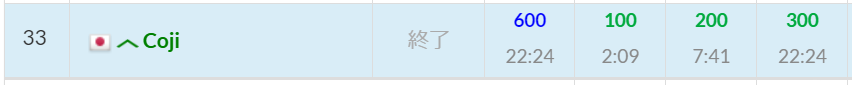
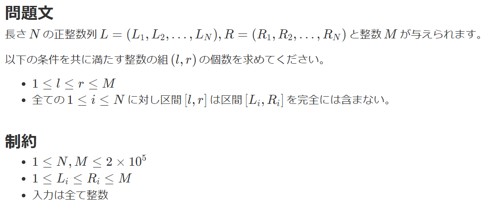

# これは何?
競プロの日記にしようと思う。 
思ったことをそのまま打ち込むだけなので、見やすくはならないと思う。 

# 10/27 ABC377のバチャ
終わったら、解けなかった問題を一門、すぬけさんの解説見た後にupsolveする。 
## 結果
ABCの3完だった。 
 
パフォーマンスは816。 
Cまではよくある問題という印象。 
Dについて解けなかったので考えてみる。 

## D-Many Segments 2
 
### 考えた解法
五月雨式に説明する。 
#### 配列Aを生成し、$imos法$を行う
配列$A$を作成し、その上で$[li,ri)$について$imos法$を行う。 
$A_i>0$なる点$A_i$から数直線上に右に長さ1の区間が塗りつぶされていると考える。 
#### 集合$set_L$の定義
塗りつぶした区間の左端となる点$L$を集合$set_L$に挿入する。 
#### $1\le l \le M$の点$l$とペアになる点$r$の個数を計算する

##### 1. $A_l=0$の場合
点$l$以上の最小の点$min_L$を二分探索で見つける。 
- $l$以上の点が存在しないならば$M-l$個
- そうでないならば$min_L-l$個

の点$r$が点$l$のペアとなりうる。 
また、点$l$が$Li=Ri$なる点$p$の集合$set_{p}$に含まれていないならば、$r=l$なる点$r$も点$l$のペアにできる。 

##### 2. $A_l>0$の場合
点$l$が
- 集合$set_{ng}$に含まれていない$\land$集合$set_L$に含まれている

ならば、$r=l$なる点$r$を点$l$のペアにできる。 

### サンプル3が合わない
上記のアルゴリズムを実装すると、サンプル3の出力が合わない。 
サンプル3の入力を数直線上に図示しようとしたらコンテストが終了してしまった。 

### 勘違い
- 「$l,r$が$[L_i,R_i]$に含まれるなら駄目」

ではなく、
- 「$l,r$が$[L_i,R_i]$を含むなら駄目」

だった

### すぬけさんの解説を見る
考え直したが、結局難しいので解説を見る。 

## 日記感想
アルゴリズムの説明を書かなければならないのが難しく、卒論の時とは異なり理解の補助になっている感じはないと思った。 
今後書くかは微妙。 

## 11/6
### RMQのSegmentTreeをソラで書けるようにしたい
スニペットを入れないで手打ちでプログラムを作成した方が、脳が活性化されて働く気がする、という経験則を手に入れた。 
それと同じような理屈で、主要なアルゴリズムやライブラリは全部ソラで書ける方が、頭が働いていいのでは？と思った。 
まずは全緑コーダー憧れのSegmentTreeをいつでもソラで書けるようになりたいと思ったので、2回ほど写経して覚えようとした。 
どうにかしてRMQのセグ木だけでも暗記に成功した、という経験が欲しい。 

## 11/7 セグ木(RMQ)暗記+ADT
写経1回+テスト2回を紙で。 
家に帰ってからテスト1回。 
家に帰ったときは、lの配列サイズを間違えてWAが出た。 
ADTは2完で悲しくなった。 
寝る前に写経を通して暗記して、翌日復習して定着を図るの、かなり効果がある。 
今日は風呂に入ったらRSQの暗記をしようと思う。 

## 11/8 セグ木(RSQ)テスト+グラフ探索アルゴリズムDFS写経
前日の夜にRSQのセグ木を写経して暗記した。 
今日の夜テストしてみたら暗記できていた。 
気が向いたらテストしてみて忘れてないか確認することにして、次の暗記するものを探す。 
グラフ探索アルゴリズムのdfsを暗記してみる。 
参考サイト:[深さ優先探索(Depth First Search)の基本](https://algo-logic.info/dfs/) 
stackを使ったdfsプログラムを始めて書いた。面白い。 
一つずつテストして、クリア出来たら次に進むことにする。 
→写経2回、テスト1回でクリア。 
再帰の方も写経しようと思う。 
→写経2回、テスト1回でクリア。 
では、スタックと再帰をそれぞれテストしてみる。 
→スタック…pop()を忘れるミス 
→再帰…クリア 
という感じになった。 
やりすぎると復習が大変なので今日はここで終わろうと思う。それか暇なので適当にセグ木(RMQ,RSQ)が書けるかテストしてみる。 
→両方ともクリア。寝る 

## 11/9 DFSでの全列挙+諸々テスト
寝起き、2種類のdfsテスト→両方OK 
dfsの続きをやったらスマークに散歩がてら行って、ひろきの誕プレでも買おうかと思う。 
→写経2回、テスト1回でクリア。 
寝る前にとっておいて、日中は別のことをしようと思う。 
寝る前になった。スタプラで時間を測るようにしてみたが、あんまり意味があるかは分からず…。 
とりあえずDFSでの全列挙を暗記して、そのあとグリッド上でのDFSをテストしてみようと思う。 
参考サイト:[再帰関数を用いた深さ優先探索(DFS)による全探索アルゴリズム](https://algo-logic.info/brute-force-dfs/) 
→DFSでの全列挙、写経2回、テスト1回でクリア。結構怪しいので、グリッド上のテストの後もう一度やってみる。 
→グリッド上のDFS、一か所だけnyをnxとしてしまい1WA。結構時間がかかった…。 
この状態でもう一度、DFSの全列挙をテストしてみる。 
→クリア。 
意外と暗記出来ていてよかった。 
セグメントツリーやstackを用いたDFS、全く覚えている気がしなくて怖いが、そう言っていても始まらないのでテストしてみる。 
→RMQ,RSQのセグ木、stack,再帰のDFSどちらもテストクリア。 
あまり詰め込みすぎてもアレなので、今日はDFSでの全列挙のみで終わりにしようかな、と思う。 
### 今後暗記したいアルゴリズム・データ構造
トポロジカルソート、ダイクストラ法、ベルマンフォード法、木の直径、プリム法、クラスカル法、ダブリング、半分全列挙、座標圧縮、Binary Indexed Tree、セグメントツリーなど 
緑diff攻略に必要なアルゴリズムを暗記したい。他にもあるかもしれない。 
基本的に1日1つ、寝る前に暗記するのが現実的かな、と思う。 
個人的な意地だが、これは三日坊主で終わらせたくない。 
この暗記を習慣付けて、空で書けるアルゴリズムを増やしていく。 

### トポロジカルソートを暗記する
明日朝起きたら面倒なことをしなければならないのが嫌で、つい暗記に走ってしまう。どうせ寝れる気もしないので、トポロジカルソートの暗記をしてみる。 
参考サイト:[トポロジカルソートのアルゴリズム（閉路のない有向グラフDAGのソート）](https://algo-logic.info/topological-sort/) 
→写経2回、テスト1回でqueueのpushとansのpush_backミス。 
次テストしてダメだったら、ノートに書くのも良いかもしれない。 
→テストしてクリア。まあまあ怪しいので明日要復習。 

### 思ったこと
どうやら順序というものがあるらしく、トポロジカルソートよりも前に、連結成分数の個数の判定などをやった方がよさそう。DFSでのトポロジカルソートを暗記したら、次はそれを暗記する。 